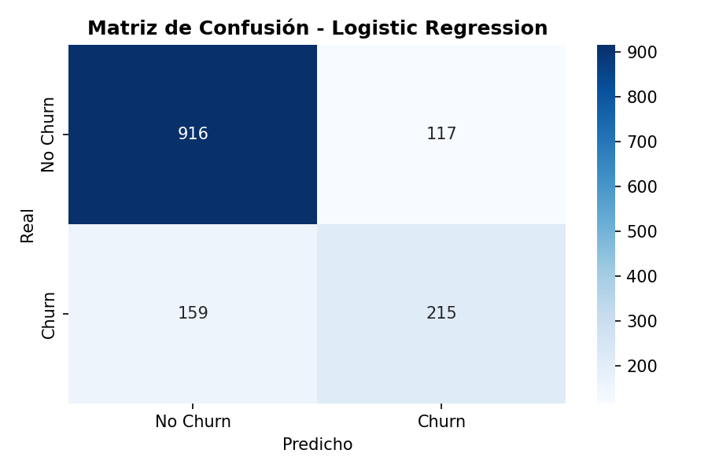

# MLOps Introduction: Final Project
FInal work description in  the [final_project_description.md](final_project_description.md) file.

Student info:
- Full name: Cristian Manuel Duche Urquizo
- e-mail: cmanuelduche@gmail.com
- Grupo: II

## Project Name: Telco Customer Churn - MLOps Final Project

Solución de Machine Learning para predecir el abandono de clientes (**Customer Churn**) en una empresa de telecomunicaciones. El modelo permite identificar proactivamente qué clientes tienen alta probabilidad de abandonar el servicio, permitiendo al equipo comercial actuar con estrategias de retención antes de que la baja ocurra.

---

## Problema

Las empresas de telecomunicaciones enfrentan pérdidas significativas por la rotación de clientes. Adquirir un nuevo cliente cuesta entre 5 y 7 veces más que retener uno existente. Sin herramientas analíticas, el equipo comercial actúa de forma reactiva — solo detecta la pérdida cuando ya ocurrió.

---

## Objetivos

- Predecir si un cliente abandonará el servicio (Churn: Sí/No)
- Implementar un pipeline completo de MLOps (datos → modelo → API)
- Servir el modelo como una API REST lista para consumo

---

## Dataset

- **Fuente:** [Telco Customer Churn - Kaggle](https://www.kaggle.com/datasets/blastchar/telco-customer-churn)
- **Archivo raw:** `data/raw/WA_Fn-UseC_-Telco-Customer-Churn.csv`
- **Filas:** 7,043 clientes
- **Columnas:** 21 variables (demográficas, servicios contratados, facturación)
- **Variable objetivo:** `Churn` (Yes/No)

---

## Estructura del Proyecto
```
├── data/
│   ├── raw/                        ← Dataset original de Kaggle
│   └── training/                   ← Dataset procesado para entrenamiento
├── experiments/                    ← Experimentos MLflow (opcional)
├── models/
│   ├── churn_model.pkl             ← Modelo champion serializado
│   └── scaler.pkl                  ← Scaler para normalización
├── notebooks/
│   └── 01_exploracion_datos.ipynb  ← Exploración y análisis de datos
├── reports/
│   ├── 01_distribucion_churn.png
│   ├── 02_numericas_vs_churn.png
│   ├── 03_categoricas_vs_churn.png
│   ├── 04_correlacion.png
│   ├── 05_confusion_matrix.png
│   └── metrics.json                ← Métricas de evaluación
├── src/
│   ├── data_preparation.py         ← Pipeline de preparación de datos
│   ├── train.py                    ← Pipeline de entrenamiento
│   └── serving.py                  ← API REST con FastAPI
├── tests/
├── requirements.txt
└── README.md
```

---

## Instalación y Configuración

### 1. Clonar el repositorio
```bash
git clone https://github.com/cducheuni/uni_mds_ciclo3_ml_project.git
cd uni_mds_ciclo3_ml_project
```

### 2. Crear entorno virtual
```bash
python -m venv MLOPS_Env
MLOPS_Env\Scripts\activate
```

### 3. Instalar dependencias
```bash
pip install -r requirements.txt
```

---

## Ejecución del Pipeline

### Paso 1 — Preparación de datos
```bash
python src/data_preparation.py
```

### Paso 2 — Entrenamiento del modelo
```bash
python src/train.py
```

### Paso 3 — Lanzar la API
```bash
uvicorn src.serving:app --reload
```

---

## Resultados del Modelo

| Modelo | Accuracy | Recall | F1-Score | ROC-AUC |
|---|---|---|---|---|
| Logistic Regression | 80.38% | 57.49% | 60.91% | 83.57% |
| Random Forest | 78.68% | 50.53% | 55.75% | 81.42% |

**Modelo Champion:** Logistic Regression  
**Criterio de selección:** Mayor Recall (detectar el máximo de clientes que abandonarán)

### Matriz de Confusión


---

## API REST - Uso

### Lanzar la API
```bash
uvicorn src.serving:app --reload
```

### Endpoints disponibles

| Método | Endpoint | Descripción |
|---|---|---|
| GET | `/` | Estado de la API |
| GET | `/health` | Health check |
| GET | `/docs` | Documentación interactiva |
| POST | `/predict` | Realizar predicción |

### Ejemplo de predicción

**Request:**
```python
import requests

cliente = {
    "gender": 1, "SeniorCitizen": 0, "Partner": 0, "Dependents": 0,
    "tenure": 2, "PhoneService": 1, "PaperlessBilling": 1,
    "MonthlyCharges": 70.5, "TotalCharges": 141.0,
    "MultipleLines_No_phone_service": 0, "MultipleLines_Yes": 1,
    "InternetService_Fiber_optic": 1, "InternetService_No": 0,
    "OnlineSecurity_No_internet_service": 0, "OnlineSecurity_Yes": 0,
    "OnlineBackup_No_internet_service": 0, "OnlineBackup_Yes": 0,
    "DeviceProtection_No_internet_service": 0, "DeviceProtection_Yes": 0,
    "TechSupport_No_internet_service": 0, "TechSupport_Yes": 0,
    "StreamingTV_No_internet_service": 0, "StreamingTV_Yes": 1,
    "StreamingMovies_No_internet_service": 0, "StreamingMovies_Yes": 1,
    "Contract_One_year": 0, "Contract_Two_year": 0,
    "PaymentMethod_Credit_card_automatic": 0,
    "PaymentMethod_Electronic_check": 1, "PaymentMethod_Mailed_check": 0
}

response = requests.post("http://127.0.0.1:8000/predict", json=cliente)
print(response.json())
```

**Response:**
```json
{
    "churn_prediction": 1,
    "churn_label": "Sí abandona",
    "churn_probability": 0.9004
}
```

---

## Métricas de Éxito

| Métrica | Meta | Resultado | Estado |
|---|---|---|---|
| Accuracy | ≥ 78% | 80.38% | ✅ |
| ROC-AUC | ≥ 80% | 83.57% | ✅ |
| Recall | ≥ 75% | 57.49% | ⚠️ |
| F1-Score | ≥ 70% | 60.91% | ⚠️ |

> El Recall por debajo de la meta es esperado dado el desbalance de clases (73%/27%). Como mejora futura se puede aplicar técnicas como SMOTE o ajuste de threshold de decisión.

---

## Tecnologías Utilizadas

- **Python 3.x**
- **pandas, numpy** — Manipulación de datos
- **scikit-learn** — Entrenamiento de modelos
- **FastAPI + uvicorn** — API REST
- **joblib** — Serialización del modelo
- **matplotlib, seaborn** — Visualización
---
